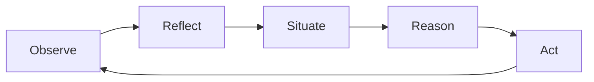

# S-ORA

A runtime for practical agents in dynamic and asynchronous environments.

An S-ORA agent is **asynchronous** (tools and communication never block each other), **concurrent** (it pursues multiple activities at once), and **reactive** (a hard interrupt keeps it responsive to high-priority events even mid-cycle). The runtime that drives it is **lightweight**, **efficient**, and **flexible** — every phase of its decision cycle is independently pluggable, and mechanical defaults are first-class, not an afterthought.

## Where things stand

S-ORA is under active development. The core runtime — the five-phase decision cycle, activities, memory modules, the action registry, and the terminal CLI — is implemented and covered by an extensive automated test suite. Advanced features — richer dynamic-environment handling, additional protocol adapters, multimodal perception, full benchmark coverage — are still in progress. The project remains **Pre-Alpha**: interfaces can still change, and this documentation site itself is mid-restructure. [README.md](https://github.com/sora-agents/sora-runtime/blob/main/README.md) and [EXAMPLES.md](https://github.com/sora-agents/sora-runtime/blob/main/EXAMPLES.md) remain the authoritative spec until it's fully absorbed here; [Architecture Decision Records](architecture/adrs/README.md) explain why specific design choices were made.

## The decision cycle

Every cycle, an agent runs the same five phases and executes at most one external action:

Model calls (planning, grounding) run off-cycle as asynchronous internal actions rather than fusing into a phase, so several activities can be pursued concurrently without serializing on a single model call. See [Decision Cycle](concepts/decision-cycle.md) for the full walkthrough.

## Find your way in

- **New to S-ORA?** [Getting Started](getting-started/overview.md) — install, run your first agent, configure an LLM.
- **Understand the design.** [Concepts](concepts/runtime-model.md) — the CoALA/BDI/Jason lineage, activities, the environment model, memory, manuals.
- **Build something.** [Guides](guides/cli-and-programmatic-runs.md) — custom strategies, dynamic environments, tool integration.
- **Learn by example.** [Tutorials](tutorials/are-email-calendar.md) — worked scenarios end to end.
- **Extend the runtime.** [Extensions](extensions/adapters.md) — adapters, strategies, memory backends, transports, LLM clients.
- **Why it's built this way.** [Architecture](architecture/overview.md) — principles, decision records, status & stability.
- **Research context.** [Research](research/experimental-use.md) — experimental use, evaluation scenarios, reproducibility.
- **Contribute.** [Development](development/contributing.md) — contributor journey, testing, agent instructions.
